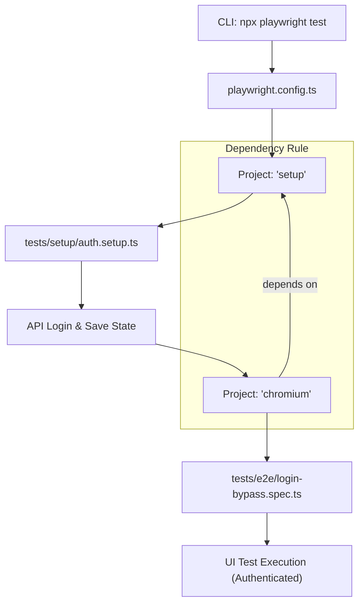
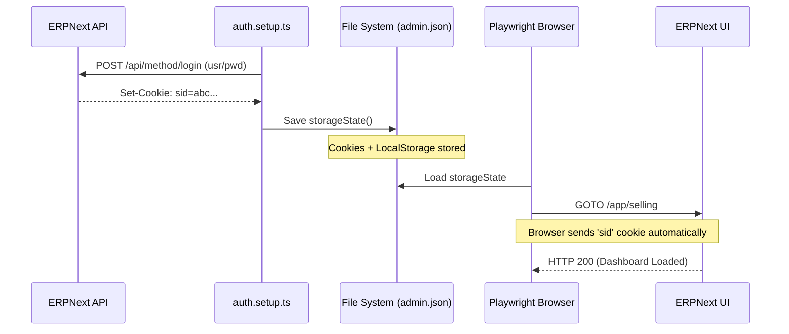

# Interview Prep: Hybrid Test Architecture (API + UI)

This document explains the "Hybrid" testing pattern implemented in this framework. This knowledge is high-value for senior QA and SDET interviews.

---

## 1. The Core Concept: Hybrid Testing
Instead of performing every action in a test through the browser UI, we use the **API for prerequisites** (Login, Data Seeding) and the **UI for business logic validation**.

### The Problem it Solves
*   **Speed**: UI login/setup takes 10–20 seconds per test. In a suite of 100 tests, that's 30+ minutes of wasted time. API setup takes milliseconds.
*   **Flakiness**: 80% of test failures happen during setup, not during the actual feature validation. Removing UI setup removes 80% of flakiness.

---

## 2. Technical Data Flow (The "Playwright Way")

1.  **Global Setup (`auth.setup.ts`)**: 
    - The framework triggers an API call (`POST /api/method/login`) via the `APIClient`.
    - Upon success, the server returns a session cookie (`sid`).
    - The framework saves this cookie and other local storage data into a JSON file (`playwright/.auth/admin.json`).

2.  **Storage State (`playwright.config.ts`)**:
    - We tell Playwright: "Before starting the browser for E2E tests, inject the cookies found in `admin.json`."

3.  **UI Execution**:
    - The browser opens the application. Because it already has the valid `sid` cookie, the application treats the user as authenticated.
    - We navigate directly to internal URLs (e.g., `/app/selling`), bypassing the login screen entirely.

---

## 3. How to answer interview questions

### Q: "How do you handle authentication in your automation suites?"
**A:** "I use a hybrid approach leveraging Playwright's **Storage State**. Instead of logging in via the UI for every test, I have a **Global Setup project** that authenticates via an API call once per suite execution. It saves the session cookies to a JSON file, which is then injected into the browser context for all subsequent UI tests. This reduces execution time by roughly 10-15 seconds per test."

### Q: "How do you ensure test isolation if you share a login?"
**A:** "We share the **session state**, but not the **test data**. I use an `APIClient` fixture to seed unique master data (like a new Customer with a timestamped name) before each test run. The UI test then executes against that specific record. This gives us the speed of a shared session with the reliability of data isolation."

### Q: "What's the benefit of writing your own API wrapper (`APIClient`)?"
**A:** "It centralizes logic. If the developers change the API endpoint from `/api/login` to `/v2/auth`, I only have to update a single line in my `APIClient` class, and every test (setup, seeding, validation) is automatically updated."

---

## 4. Key Terminology for your Resume
*   **Storage State**: Playwright's mechanism for capturing/restoring authenticated browser states.
*   **Project Dependencies**: Configuring Playwright to run a setup project (Auth) before a main project (E2E).
*   **Data Seeding**: Using API to create prerequisites so UI tests are dedicated to UX/Business flow validation.
*   **Separation of Concerns**: UI tests for UI/UX; API setup for state/data management.

---

## 5. Visualizing the Hybrid Flow

Understanding the orchestration between Playwright and your application is crucial for higher-level roles.

### Control Flow (Execution Order)
This diagram shows how Playwright ensures authentication happens *before* any UI tests begin.



### Data Flow (Auth Lifecycle)
This diagram shows how the session cookie travels through the system to enable the bypass.



---

## 6. Deep Dive: Line-by-Line Breakdown

This section provides the "How" for each critical file, perfect for answering technical implementation questions.

### A. The Setup Hook (`auth.setup.ts`)

```typescript
// 10: setup('authenticate as Administrator', async ({ apiClient, request }) => {
```
*   **What's happening**: We define a `setup` test (a special run once per suite). We destructure `apiClient` (our framework fixture) and `request` (Playwright's low-level API utility).

```typescript
// 12: const response = await apiClient.login('Administrator', 'admin');
```
*   **What's happening**: We trigger the API login code. This hits the server, which responds with a `Set-Cookie` header containing the `sid` (session ID).

```typescript
// 16: await request.storageState({ path: authFile });
```
*   **What's happening**: **This is the most important line.** It reaches into the current request context, extracts all active cookies and local storage items, and serializes them into a JSON file (`admin.json`).

### B. The Configuration Orchestration (`playwright.config.ts`)

```typescript
// 14: name: 'setup', testMatch: /.*\.setup\.ts/,
```
*   **What's happening**: We create a dedicated project for setup tasks. This keeps authentication logic separate from functional tests.

```typescript
// 24: dependencies: ['setup'],
```
*   **What's happening**: This tells Playwright: "Do not start the `chromium` project until the `setup` project has finished successfully." This ensures the `admin.json` file actually exists before we try to use it.

```typescript
// 22: storageState: 'playwright/.auth/admin.json',
```
*   **What's happening**: Before Playwright opens a browser window for an E2E test, it reads this JSON file and "injects" those cookies into the browser's context. The browser is essentially "pre-authenticated."

### C. The E2E Bypass (`login-bypass.spec.ts`)

```typescript
// 12: await basePage.navigateTo('/app/selling');
```
*   **What's happening**: Since the browser already has the `sid` cookie, we don't need to visit `/login`. We navigate directly to an internal dashboard.

```typescript
// 15: await expect(page).not.toHaveURL(/.*login/);
```
*   **What's happening**: We assert that the application *accepted* our session. If the session was invalid, the ERP would have redirected us back to the login page. This line proves the bypass worked.

```typescript
// 18: await expect(page.locator('.page-container')).toBeVisible({ timeout: 15000 });
```
*   **What's happening**: We check for a UI element that only exists *inside* the app. This is the final verification that we have successfully bypassed the UI login and landed on the functional dashboard.
